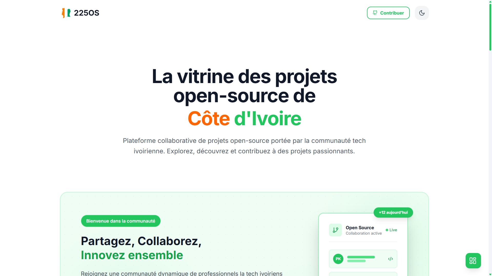

<div align="center">

</div>

# 225 Open Source

[](https://opensource.org/licenses/MIT)
[](http://makeapullrequest.com)
[](https://github.com/kouame09/225opensource/stargazers)

> Répertoire des projets open source développés pour la communauté tech ivoirienne.

## 📋 Table des matières

- [Présentation](#-présentation)
- [Fonctionnalités](#-fonctionnalités)
- [Technologies utilisées](#-technologies-utilisées)
- [Installation](#-installation)
- [Configuration](#-configuration)
- [Développement](#-développement)
- [Structure du projet](#-structure-du-projet)
- [Contribution](#-contribution)
- [Licence](#-licence)
- [Remerciements](#-remerciements)

## 🌟 Présentation

225 Open Source est une plateforme qui référence et met en avant les projets open source développés par la communauté tech ivoirienne. Notre objectif est de promouvoir l'innovation locale, de faciliter la découverte de projets intéressants et d'encourager la collaboration entre professionnels de la tech Ivoirienne.

## ✨ Fonctionnalités

- 📂 **Catalogue** : Parcourez une collection croissante de projets open source
- 🔍 **Recherche avancée** : Trouvez des projets par nom, technologie ou catégorie
- 📊 **Statistiques** : Visualisez les tendances des projets (étoiles, forks, mises à jour)
- 👥 **Communauté** : Découvrez les contributeurs et mainteneurs actifs
- 🌍 **Localisation** : Focus sur les projets ivoiriens et africains

## 🛠 Technologies utilisées

- **Frontend** :
  - React 18 avec TypeScript
  - Vite comme bundler
  - TailwindCSS pour le styling
  - React Router pour la navigation
  - Lucide Icons pour les icônes

- **Backend & Services** :
  - Firebase pour l'authentification et la base de données
  - Supabase comme alternative de backend

- **Outils de développement** :
  - ESLint et Prettier pour la qualité du code
  - Git pour le contrôle de version
  - GitHub pour l'hébergement et la collaboration

## 🚀 Installation

### Prérequis

- Node.js (version 18 ou supérieure)
- npm (version 9 ou supérieure) ou yarn
- Compte Firebase (pour la configuration)

### Étapes d'installation

1. **Cloner le dépôt** :
   ```bash
   git clone https://github.com/kouame09/225opensource.git
   cd 225opensource
   ```

2. **Installer les dépendances** :
   ```bash
   npm install
   # ou
   yarn
   ```

3. **Configurer les variables d'environnement** :
   Créez un fichier `.env` à la racine du projet avec les variables suivantes :
   ```env
   VITE_FIREBASE_API_KEY=votre_cle_api
   VITE_FIREBASE_AUTH_DOMAIN=votre_projet.firebaseapp.com
   VITE_FIREBASE_PROJECT_ID=votre_projet_id
   VITE_FIREBASE_STORAGE_BUCKET=votre_bucket.appspot.com
   VITE_FIREBASE_MESSAGING_SENDER_ID=votre_sender_id
   VITE_FIREBASE_APP_ID=votre_app_id

   ```

4. **Démarrer l'application en mode développement** :
   ```bash
   npm run dev
   # ou
   yarn dev
   ```

5. **Ouvrir dans le navigateur** :
   L'application sera disponible à l'adresse : [http://localhost:5173](http://localhost:5173)

## ⚙️ Configuration

### Variables d'environnement

| Variable | Description | Requis |
|----------|-------------|--------|
| `VITE_FIREBASE_*` | Configuration Firebase | Oui |

### Scripts NPM

- `dev` : Lance le serveur de développement
- `build` : Construit l'application pour la production
- `preview` : Prévient l'application de production localement
- `lint` : Exécute ESLint pour vérifier le code
- `typecheck` : Vérifie les types TypeScript

## 🛠 Développement

### Structure du projet

```
src/
├── components/     # Composants réutilisables
├── config/         # Fichiers de configuration
├── contexts/       # Contextes React
├── pages/          # Pages de l'application
├── services/       # Services (API, Firebase, etc.)
├── types/          # Définitions de types TypeScript
└── utils/          # Utilitaires et helpers
```

### Standards de code

- Utilisez TypeScript pour tout nouveau code
- Suivez les règles ESLint et Prettier configurées
- Écrivez des tests unitaires pour les nouvelles fonctionnalités
- Documentez les composants et fonctions complexes
- Utilisez des noms de variables et fonctions descriptifs

## 🤝 Contribution

Les contributions sont les bienvenues ! Voici comment contribuer :

1. **Signaler un bug** : 
   - Vérifiez d'abord si le bug n'a pas déjà été signalé dans les [issues](https://github.com/kouame09/225opensource/issues)
   - Créez une nouvelle issue en suivant le modèle fourni

2. **Proposer une amélioration** :
   - Ouvrez une issue pour discuter de votre proposition
   - Une fois validée, vous pouvez commencer à travailler dessus

3. **Soumettre du code** :
   1. Forkez le dépôt
   2. Créez une branche pour votre fonctionnalité : `git checkout -b feature/nouvelle-fonctionnalite`
   3. Committez vos changements : `git commit -m 'Ajoute une nouvelle fonctionnalité'`
   4. Poussez vers votre fork : `git push origin feature/nouvelle-fonctionnalite`
   5. Créez une Pull Request

### Format des commits

Nous utilisons [Conventional Commits](https://www.conventionalcommits.org/) :

```
<type>[optional scope]: <description>

[optional body]

[optional footer(s)]
```

Exemple :
```
feat(auth): ajoute la connexion avec Google

Ajoute la possibilité de se connecter avec un compte Google en utilisant Firebase Auth.

Closes #123
```

## 📄 Licence

Ce projet est sous licence MIT - voir le fichier [LICENSE](LICENSE) pour plus de détails.

## 🙏 Remerciements

- À tous les contributeurs qui rendent ce projet possible
- À la communauté tech ivoirienne pour son dynamisme et sa créativité
- Aux mainteneurs des projets open source utilisés dans ce projet

Consultez les commentaires détaillés dans le fichier `src/data.ts` pour plus d'instructions.

## Technologies utilisées

- React
- TypeScript
- Tailwind CSS
- Vite
- Firebase
- Lucide Icons


## Auteur

Développé par Prince Kouamé et soutenu par la communauté tech ivoirienne.

## Licence

Ce projet est sous licence MIT. Voir le fichier `LICENSE` pour plus de détails.
